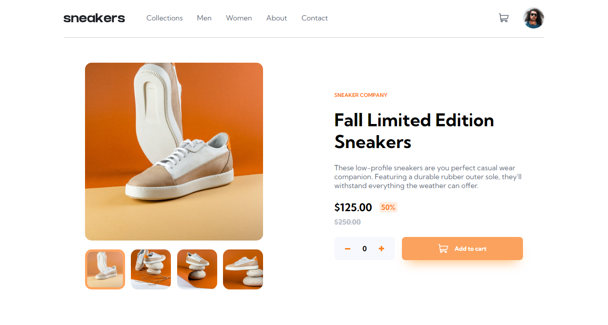

# Frontend Mentor - Newsletter sign-up form with success message solution

This is a solution to the [E-commerce product page challenge on Frontend Mentor](https://www.frontendmentor.io/challenges/ecommerce-product-page-UPsZ9MJp6). Frontend Mentor challenges help you improve your coding skills by building realistic projects. 

## Table of contents

- [Overview](#overview)
  - [The challenge](#the-challenge)
  - [Screenshot](#screenshot)
  - [Links](#links)
- [My process](#my-process)
  - [Built with](#built-with)
  - [What I learned](#what-i-learned)
- [Author](#author)

## Overview

### The challenge

Users should be able to:

- View the optimal layout for the site depending on their device's screen size
- See hover states for all interactive elements on the page
- Open a lightbox gallery by clicking on the large product image
- Switch the large product image by clicking on the small thumbnail images
- Add items to the cart
- View the cart and remove items from it

### Screenshot

### Links

- Solution URL: [Solution URL](https://www.frontendmentor.io/solutions/responsive-ecommerce-product-page-using-react-typescript-3sqEcrcwOV)
- Live Site URL: [Live Site](https://ecommerce-product-page-h6edu0rjo-joaovictormendessilva.vercel.app/)

## My process

### Built with

- HTML
- CSS
- JavaScript
- React
- TypeScript

### What I learned

- Portuguese Version:
  Este projeto me ajudou a praticar os meus conhecimentos em typescript e validação de formulários.

- English Version:
  This project helped me to practice my knowledge in TypeScript, React and form validation.

## Author

- Linkedin - [Linkedin João Victor Mendes Silva](https://www.linkedin.com/in/joaovictormendessilva/)
- Frontend Mentor - [@joaovictormendessilva](https://www.frontendmentor.io/profile/joaovictormendessilva)
